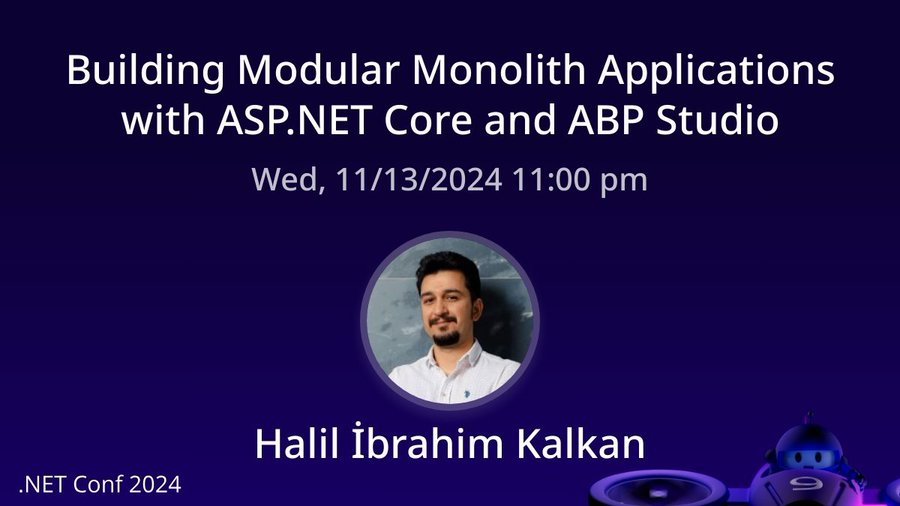

# Highlights for ASP.NET Core & Entity Framework Core features shipped with .NET 9.0

As Volosoft, we are passionate about the technology and tools we work on. Since our open-source and commercial developer platforms are based on Microsoft's .NET technology, we are closely following the .NET team for new releases, features, and improvements made in each release.

In November 2024, exciting things happening in the .NET world and in this blog post, we are covering some of them.

## .NET Conf 2024

Microsoft organized the .NET Conf 2024 between November 12 and 14 as an online event. There were many speakers who talked at the conference from all around the world. 

The co-founder of [Volosoft](https://volosoft.com/) and Lead Developer of the [ABP](https://abp.io/), [Halil Ibrahim Kalkan](https://x.com/hibrahimkalkan) gave a speech about "Building Modular Applications with ASP.NET Core & ABP".

In his session, he talked about building modular applications, and mentioned how [ABP Studio](https://abp.io/studio) helps you to create fully modular systems easier with ASP.NET Core.

## What's new with ASP.NET & Entity Framework Core 9.0

Microsoft released the .NET 9.0 in the .NET Conf 2024, with ASP.NET Core 9.0 and Entity Framework Core 9.0.

Our team has closely followed the ASP.NET Core and Entity Framework Core 9.0 releases, read Microsoft's guides, documentation, and adapted the changes to our ABP.IO Platform. We are proud to say that we shipped the ABP 9.0 RC.1 based on .NET 9.0 just after Microsoft's .NET 9.0 pre-release and we are going to share the v9.0 with .NET 9.0 stable release soon.

In addition to the ABP's .NET 9.0 upgrade, the team has created many great articles to highlight the important features coming with ASP.NET Core 9.0 and Entity Framework Core 9.0. Here, is a list of all the articles:

### ASP.NET Core 9.0

* [Optimizing Static Asset Delivery feature in ASP.NET Core 9.0](https://abp.io/community/articles/optimizing-static-asset-delivery-feature-in-asp.net-core-9.0-gyv140vb) by [Liming Ma](https://abp.io/community/members/maliming)
* [Hybrid Cache in .NET 9](https://abp.io/community/articles/hybrid-cache-in-.net-9-5s0l2pa6) by [Engincan Veske](https://abp.io/community/members/EngincanV)
* [.NET Aspire 9.0 Features](https://abp.io/community/articles/.net-aspire-9.0-features-q7nojisw) by [İsmail Çağdaş](https://abp.io/community/members/ismcagdas)
* [.NET 9.0 SignalR supports trimming and Native AOT](https://abp.io/community/articles/.net-9.0-signalr-supports-trimming-and-native-aot-4oxx0qbs) by [Ahmet Faruk Ulu](https://abp.io/community/members/ahmetfarukulu)
* [Built-in OpenAPI Document Generation with .NET 9 — No more SwaggerUI! 👋](https://abp.io/community/articles/builtin-openapi-document-generation-with-.net-9-no-more-swaggerui--au56cck5) by [Alper Ebiçoğlu](https://abp.io/community/members/alper)
* [Middleware Now Supports Keyed Dependency Injection in .NET 9](https://abp.io/community/articles/middleware-now-supports-keyed-dependency-injection-in-.net-9-4whni6rx) by [Salih Özkara](https://abp.io/community/members/salih)

### Entity Framework 9.0

* [EF Core 9 LINQ & SQL translation](https://abp.io/community/articles/ef-core-9-linq-sql-translation-b7pzcj09) by [liangshiwei](https://community.abp.io/members/liangshiwei)

We enjoyed writing these, we hope you also enjoy and like them while reading. Happy coding!

-- The Volosoft Team