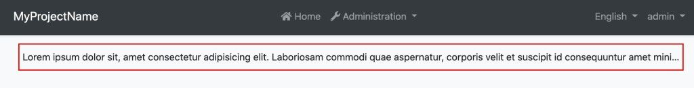
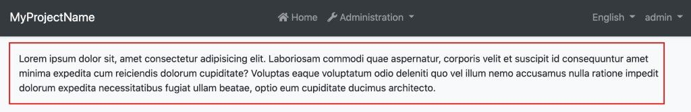
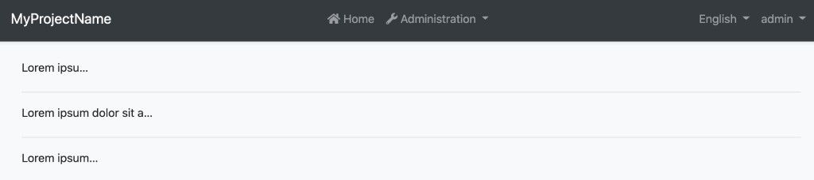

# Ellipsis

Text inside an HTML element can be truncated easily with an ellipsis by using CSS. To make this even easier, you can use the `EllipsisDirective` which is provided by the `@abp/ng.theme.shared` package.

## Getting Started

To use the `EllipsisDirective` in your component, you should now import it directly (as a standalone directive) like this:

```js
import { EllipsisDirective } from '@abp/ng.theme.shared';
```

You can add it directly to your `standalone` component's `imports` array:

```js
import { Component } from '@angular/core';
import { EllipsisDirective } from '@abp/ng.theme.shared';

@Component({
  selector: 'your-component',
  standalone: true,
  imports: [EllipsisDirective],
  template: `
    <p abpEllipsis>
      Lorem ipsum dolor sit, amet consectetur adipisicing elit. Laboriosam commodi quae aspernatur,
      corporis velit et suscipit id consequuntur amet minima expedita cum reiciendis dolorum
      cupiditate? Voluptas eaque voluptatum odio deleniti quo vel illum nemo accusamus nulla ratione
      impedit dolorum expedita necessitatibus fugiat ullam beatae, optio eum cupiditate ducimus
      architecto.
    </p>
  `
})
export class YourComponent {}
```

> **Note:**  
> The previous way of importing `EllipsisModule` is now obsolete and should be removed from your codebase.

## Usage

The `EllipsisDirective` is very easy to use. The directive selector is **`abpEllipsis`**. By adding the `abpEllipsis` attribute to an HTML element, you can activate the `EllipsisDirective` for that element.

Example usage in your template:

```html
<p abpEllipsis>
    Lorem ipsum dolor sit, amet consectetur adipisicing elit. Laboriosam commodi quae aspernatur,
    corporis velit et suscipit id consequuntur amet minima expedita cum reiciendis dolorum
    cupiditate? Voluptas eaque voluptatum odio deleniti quo vel illum nemo accusamus nulla ratione
    impedit dolorum expedita necessitatibus fugiat ullam beatae, optio eum cupiditate ducimus
    architecto.
</p>
```

The `abpEllipsis` attribute is added to the `<p>` element to activate the `EllipsisDirective`.

See the result:



The long text has been truncated by using the directive.

The UI before using the directive looks like this:



### Specifying Max Width of an HTML Element

You can specify the maximum width of an element using the directive like this:

```html
<div [abpEllipsis]="'100px'">
 Lorem ipsum dolor sit amet consectetur adipisicing elit. Cumque, optio!
</div>

<div [abpEllipsis]="'15vw'">
 Lorem ipsum dolor sit amet consectetur adipisicing elit. Cumque, optio!
</div>

<div [abpEllipsis]="'50%'">
 Lorem ipsum dolor sit amet consectetur adipisicing elit. Cumque, optio!
</div>
```

See the result:


